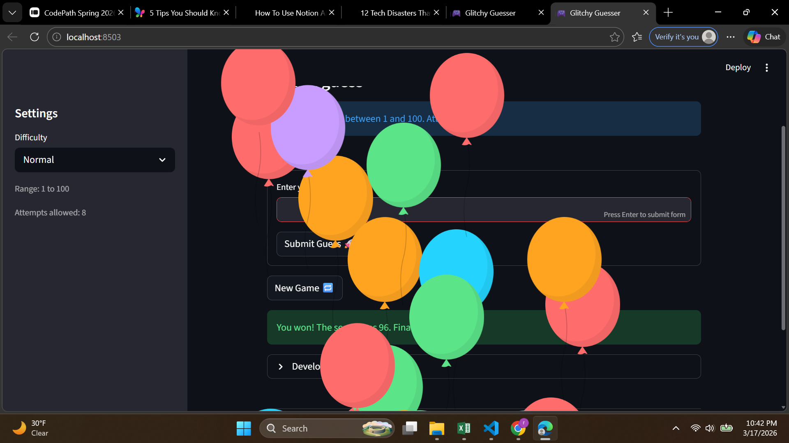

# 🎮 Game Glitch Investigator: The Impossible Guesser

## 🚨 The Situation

You asked an AI to build a simple "Number Guessing Game" using Streamlit.
It wrote the code, ran away, and now the game is unplayable. 

- You can't win.
- The hints lie to you.
- The secret number seems to have commitment issues.

## 🛠️ Setup

1. Install dependencies: `pip install -r requirements.txt`
2. Run the broken app: `python -m streamlit run app.py`

## 🕵️‍♂️ Your Mission

1. **Play the game.** Open the "Developer Debug Info" tab in the app to see the secret number. Try to win.
2. **Find the State Bug.** Why does the secret number change every time you click "Submit"? Ask ChatGPT: *"How do I keep a variable from resetting in Streamlit when I click a button?"*
3. **Fix the Logic.** The hints ("Higher/Lower") are wrong. Fix them.
4. **Refactor & Test.** - Move the logic into `logic_utils.py`.
   - Run `pytest` in your terminal.
   - Keep fixing until all tests pass!

## 📝 Document Your Experience

- [x] Describe the game's purpose.

  This is a number guessing game built with Streamlit. The player picks a difficulty (Easy, Normal, or Hard), which determines the range of possible numbers. Each round, a secret number is randomly chosen and the player has a limited number of attempts to guess it. After each guess, the game gives a hint ("Go HIGHER" or "Go LOWER") to help narrow it down. The player earns points for winning, and loses points for wrong guesses. The game was intentionally shipped with several bugs to practice debugging AI-generated code.

- [x] Detail which bugs you found.

  1. *Secret number kept resetting* — every click caused a full page rerun, and the secret was being regenerated each time instead of staying the same.
  2. *Difficulty ranges were wrong* — Normal (1–50) had a narrower range than Hard (1–100), making Hard easier than Normal.
  3. *String coercion on even attempts* — every other guess, the secret number was converted to a string using `str()`. This caused wrong comparisons because Python compares strings letter by letter, not numerically.
  4. *"Too High" rewarded points* — on even-numbered attempts, a wrong "Too High" guess gave the player +5 points instead of deducting points.
  5. *Info message hardcoded the range* — the hint bar always said "Guess a number between 1 and 100" regardless of the selected difficulty.
  6. *Invalid guesses were logged to history* — typing something like "abc" still got added to the guess history even though it wasn't a valid guess.
  7. *Win message showed twice* — when the player won, the "🎉 Correct!" message appeared as a yellow warning box AND as a green success box at the same time.
  8. *History updated one guess late* — the debug expander was rendered before the submit logic ran, so it always showed the previous guess instead of the current one.

- [x] Explain what fixes you applied.

  1. Wrapped the secret generation in `if "secret" not in st.session_state` so it only runs once and persists across reruns.
  2. Fixed the difficulty ranges: Easy = 1–20, Normal = 1–100, Hard = 1–1000.
  3. Removed the `str()` coercion — the secret is now always passed as a number to `check_guess`.
  4. Removed the even/odd condition in `update_score` — "Too High" now always deducts 5 points.
  5. Replaced the hardcoded "1 and 100" with `{low}` and `{high}` variables.
  6. Removed `history.append` from the invalid guess branch so only real number guesses are tracked.
  7. Added `outcome != "Win"` condition to the hint display so the win message only appears once via `st.success`.
  8. Moved the debug expander to the bottom of the page so it renders after the submit logic updates session state.
  9. Moved all game logic (`check_guess`, `parse_guess`, `update_score`, `get_range_for_difficulty`) into `logic_utils.py` and imported them into `app.py`.
  10. Replaced the plain text input + button with `st.form(clear_on_submit=True)` to reduce reruns and auto-clear the input after each guess.

## 📸 Demo

- [x] 

## 🚀 Stretch Features

- [ ] [If you choose to complete Challenge 4, insert a screenshot of your Enhanced Game UI here]
